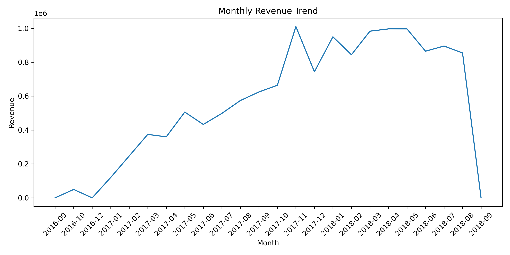
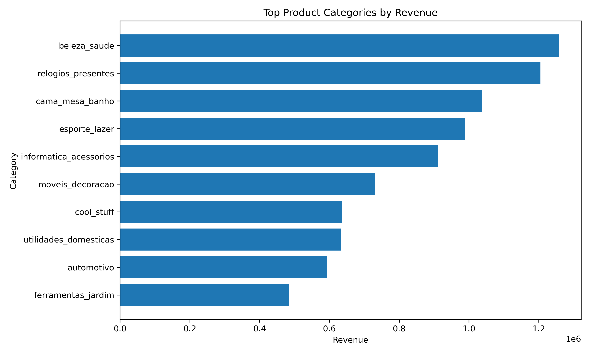
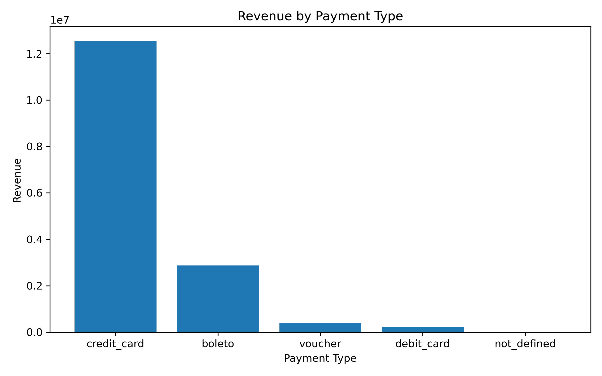

# Brazilian E-commerce Analytics

## Overview
This project analyzes the Brazilian Olist e-commerce dataset to evaluate revenue performance, customer behavior, and product category trends.
It demonstrates end-to-end data analysis and business intelligence workflow using **SQL**, **Python (pandas)**, and **Tableau**.

## Key findings:

- Revenue peaked in November 2017 at \$1,010,271, indicating strong Q4 seasonality.
- Average Order Value (AOV) is \$137.75, suggesting mid-to-high transaction value per purchase.
- Repeat purchase rate is 3.12%, revealing low customer retention and a major opportunity for lifecycle marketing.
- Top revenue-driving categories are:
  - beleza_saude (\$1.26M)
  - relogios_presentes (\$1.21M)
  - cama_mesa_banho (\$1.04M)

Overall, the business shows strong category concentration and seasonal demand spikes but significant room for improvement in customer retention.

## Dataset
- Source: [Olist Brazilian E-commerce Public Dataset](https://www.kaggle.com/olistbr/brazilian-ecommerce)  
- Format: CSV files  
- Main tables used:
  - `orders`  
  - `order_items`  
  - `customers`  
  - `order_payments`  
  - `products`

---

## Tools & Technologies
- **SQL** (SQLite) – data extraction and joins  
- **Python** (pandas, matplotlib) – data cleaning and analysis  
- **Tableau / Power BI** – dashboard and visualization  
- **Git/GitHub** – version control

---

## Key Analyses
- **Revenue Trends** – monthly and overall revenue  
- **Customer Insights** – new vs. returning customers, repeat purchase rate  
- **Product Performance** – top categories and top-selling products  
- **Average Order Value (AOV)** – key metric for business performance  
- **Optional Bonus:** Cohort retention analysis, geographic insights

---

## Insights & Findings

**Revenue Trend**
- Monthly revenue shows clear seasonality, with a major peak in November 2017 (\$1.01M), likely driven by holiday promotions and Black Friday activity.
- Revenue concentration in Q4 suggests marketing effectiveness during promotional periods.

**Customer Behavior**
- Average Order Value (AOV) of \$137.75 indicates healthy basket size.
- Repeat purchase rate is only 3.12%, which is relatively low for e-commerce and signals an opportunity to improve customer retention strategies.

**Product Performance**
- Top-performing categories:
  1. beleza_saude — \$1.26M
  2. relogios_presentes — \$1.21M
  3. cama_mesa_banho — \$1.04M
- Revenue is heavily concentrated in lifestyle and home-related products.

**Business Opportunities**
- Implement retention programs (email, loyalty, remarketing) to increase repeat purchases.
- Double down on high-performing categories.
- Investigate drivers behind November revenue spike and replicate successful campaigns.
---

## Visualizations

### Monthly Revenue Trend

### Top Product Categories by Revenue

### Revenue by Payment Type

## Final Business Recommendations

Based on the analysis:

1. Customer retention should be the top priority given the low repeat purchase rate (3.12%).
2. Marketing efforts should be optimized around Q4 when demand is highest.
3. Inventory and promotions should focus on top-performing categories (beleza_saude, relogios_presentes, cama_mesa_banho).
4. Further analysis could explore customer segmentation and cohort retention.

This analysis demonstrates how data-driven insights can guide e-commerce growth strategy.